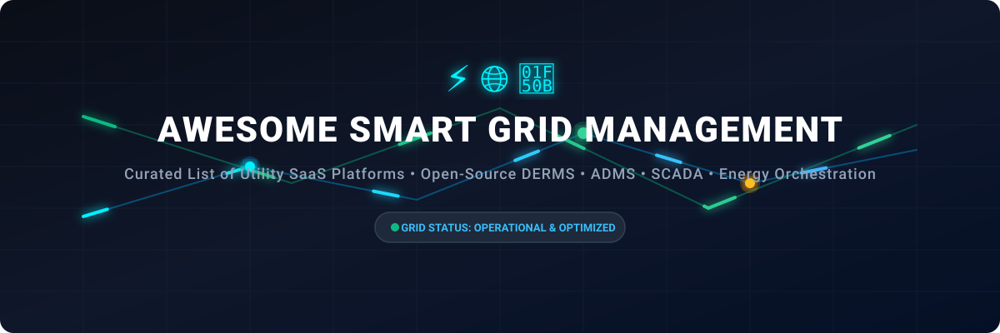

# ⚡ Awesome Smart Grid Management 🌐

  

  
  
  
  
  

## 💡 Overview & Ecosystem

A curated list of top **Smart Grid Management** SaaS platforms, Advanced Distribution Management Systems (**ADMS**), Distributed Energy Resource Management Systems (**DERMS**), **SCADA**, Energy Management Systems (**EMS**), Microgrid Controllers, and open-source power system analysis frameworks.

These operational technology (OT) platforms enable electrical utilities, system operators, and DER aggregators to monitor, control, optimize, and orchestrate real-time grid telemetry, voltage regulation, outage response, and flexible demand response.

---

## 📌 Table of Contents
- [🏢 SaaS/Hosted Platforms](#-saashosted-platforms)
- [💻 Open-Source GitHub Projects](#-open-source-github-projects)
- [🤝 How to Contribute](#-how-to-contribute)
- [⚖️ Disclaimer](#%EF%B8%8F-disclaimer)
- [📈 Star History](#-star-history)

---

## 🏢 SaaS/Hosted Platforms

> 📊 **Market Insights**: The global Smart Grid Management and ADMS/DERMS market size is estimated at **$45.8 Billion in 2026** (projected to reach $100+ Billion by 2032 at a CAGR of ~14.5%). The sector is **moderately concentrated** at the core utility SCADA/ADMS layer (dominated by industrial conglomerates like Siemens, Schneider Electric, Hitachi, GE Vernova, and AspenTech), while experiencing **moderate fragmentation** at the grid-edge DERMS and virtual power plant (VPP) software tier.

| Product Name | Company Size (Valuation / Revenue) | Description | Pricing | Free Tier / Trial Limits |
|---|---|---|---|---|
| **[Siemens Grid Software / Gridscale X](https://www.siemens.com/)** | 🏢 ~$230B Market Cap / ~$85B Revenue (Siemens AG) | Comprehensive grid software suite covering planning, operations, ADMS/DERMS capabilities, digital twins, and AI-assisted flexibility management. | $3,800/month ($45,600/year starting tier) | 60-day free trial (up to 150 grid nodes limit) |
| **[Schneider Electric EcoStruxure Grid / ADMS](https://www.se.com/)** | 🏢 ~$140B Market Cap / ~$40B Revenue (Schneider Electric) | Industry-recognized Advanced Distribution Management System with strong DER management, outage response, Volt/VAR optimization, and grid-edge capabilities. | $1,200/month ($14,400/year starting tier) | 30-day free trial (up to 25 connected grid edge assets) |
| **[Hitachi Energy Lumada APM](https://www.hitachienergy.com/)** | 🏢 ~$110B Market Cap / ~$70B Revenue (Hitachi Ltd.) | Asset performance and grid management solutions focused on reliability, predictive maintenance, and operational intelligence for power systems. | $2,083/month ($25,000/year starting tier) | 30-day guided evaluation sandbox (up to 50 monitored asset models) |
| **[GE Vernova GridOS](https://www.gevernova.com/)** | 🏢 ~$50B Market Cap / ~$35B Revenue (GE Vernova) | Grid orchestration platform designed for transmission and distribution, supporting real-time coordination, renewables integration, and resilient operations. | $4,166/month ($50,000/year starting tier) | 30-day proof-of-concept trial (1 simulated substation environment) |
| **[OSI Monarch (AspenTech)](https://www.aspentech.com/)** | 🏢 ~$15B Market Cap / ~$1.1B Revenue (AspenTech) | High-performance OT-native platform for real-time grid telemetry, SCADA, and mission-critical utility operations. | $4,166/month ($50,000/year starting tier) | 30-day request-based sandbox evaluation (up to 25 telemetry points) |
| **[Smarter Grid Solutions (ANM Strata)](https://www.smartergridsolutions.com/)** | 🏢 ~$10B Market Cap / ~$150M Division Valuation (Wärtsilä) | Active Network Management & DERMS platform focused on autonomous grid control, localized constraint management, and DER orchestration. | $1,666/month ($20,000/year starting tier) | 30-day developer evaluation license (up to 10 DER interconnection nodes) |
| **[EnergyHub](https://www.energyhub.com/)** | 🏢 ~$3B Market Cap / ~$100M ARR (Alarm.com parent) | Grid-edge DERMS and virtual power plant platform connecting utility systems with residential and commercial distributed energy devices. | $1,500/month ($18,000/year starting tier) | 30-day sandbox evaluation trial (up to 500 connected smart device endpoints) |
| **[Uplight](https://www.uplight.com/)** | 🦄 ~$1.5B Valuation (Unicorn) | Customer engagement and energy management platform that helps utilities activate demand-side flexibility and optimize energy use. | $1,666/month ($20,000/year starting tier) | 30-day platform demonstration trial (up to 1,000 simulated customer accounts) |
| **[AutoGrid Flex](https://www.auto-grid.com/)** | 💼 ~$500M Valuation (Uplight subsidiary) | Flexibility management and DERMS platform enabling real-time optimization of distributed energy resources at scale for utilities and aggregators. | $1,250/month ($15,000/year starting tier) | 30-day sandbox trial (up to 10 MW managed capacity / 100 DER endpoints) |
| **[Camus Energy](https://camus.energy/)** | 🚀 ~$50M Valuation ($25M+ Venture Funded) | Grid management and DER orchestration SaaS platform enabling real-time visibility, load forecasting, and local flexibility management for utilities. | $1,000/month ($12,000/year starting tier) | 30-day free trial sandbox (up to 5 MW monitored capacity / 50 feeder assets) |

---

## 💻 Open-Source GitHub Projects

> ⚡ **Note**: While full mission-critical utility ADMS/SCADA systems remain commercial due to strict safety and regulatory compliance, open-source projects provide powerful building blocks for power system analysis, energy management, microgrid control, and IEC 61850 protocol integration.

- **[PyPSA](https://github.com/PyPSA/PyPSA)**   
  Python for Power System Analysis. Open-source toolbox for simulating and optimizing modern power systems, optimal power flow (OPF), sector coupling, and high-share renewable integration.

- **[OpenEMS](https://github.com/OpenEMS/openems)**   
  Open Source Energy Management System. Modular framework for energy management, microgrids, battery energy storage systems (BESS), solar PV regulation, and smart grid edge control.

- **[libIEC61850](https://github.com/mz-automation/libiec61850)**   
  Open-source C library implementation of the IEC 61850 communication standard for power system automation, substation communication, MMS, GOOSE, and Sampled Values.

- **[MyEMS](https://github.com/MyEMS/myems)**   
  Industry-leading open-source Energy Management System aligned with ISO 50001. Monitors, analyzes, and reports energy and carbon data with extensions for microgrids, PV, and storage.

- **[GridLAB-D](https://github.com/GridLAB-D/gridlab-d)**   
  Power distribution system simulation and grid-edge modeling environment developed by US Department of Energy / PNNL for smart grid technology research.

- **[Alliander DER Scheduling](https://github.com/alliander-opensource/der-scheduling)**   
  Open-source scheduling stack for Distributed Energy Resources (DER) control according to IEC 61850 standards, aimed at production-grade DER coordination.

- **[EnergyLink Open-Source DERMS](https://github.com/vpdeva/Energylink-Open-Source-DERMS)**   
  Open-source platform exploring energy data exchange, DERMS concepts, telemetry connectors, analytics, and operator dashboarding.

- **[Mini-DERMS / Feeder Controllers](https://github.com/ceh6514/Mini-DERMS-Feeder-Controller)**   
  Educational and prototyping framework for feeder-level DER coordination, SCADA telemetry ingestion, closed-loop control, and operator dashboards.

### 🛠️ Ecosystem Components & Tooling
- **Time-Series & Analytics Stacks**: InfluxDB, TimescaleDB, Grafana, Prometheus.
- **Protocol & IoT Messaging**: Mosquitto (MQTT), Modbus, DNP3, IEC 60870-5-104.
- **Optimization & Forecasting**: PyPSA, SciPy, OpenStudio, GridLAB-D.

---

## 🤝 How to Contribute

1. Fork the repository 🍴
2. Add or edit entries in `README.md` following the tabular format.
3. Include: Product name, official link, 1–2 sentence description, pricing/trial details, or open-source star badge.
4. Submit a Pull Request (PR) with a brief summary 🚀

---

## ⚖️ Disclaimer

- This list is **community-curated** for informational and educational purposes.
- Utility grid control platforms are mission-critical systems affecting public safety and infrastructure security. Live utility deployments must comply with relevant NERC-CIP, IEEE, and local regulatory standards.

---

## 📈 Star History

---

**Made with ❤️ for utility operators, grid engineers, energy technologists, and researchers.**

